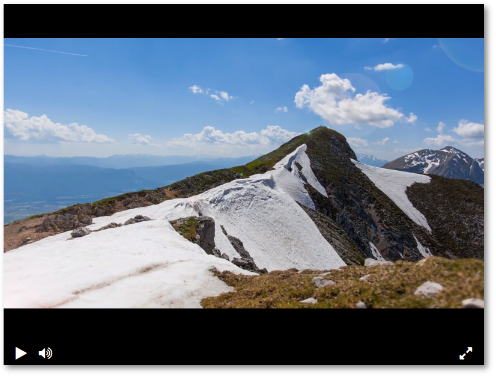

# Видеоплеер

## Прототип плейера для сайта

[Документация плеера](https://github.com/devmanorg/video-player-jslib "JavaScript-библиотека, которая проигрывает видео в браузере")

## Цели проекта

Код написан в учебных целях — это командный проект на курсе по Python [Devman](https://dvmn.org).

